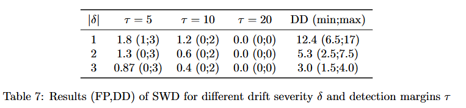
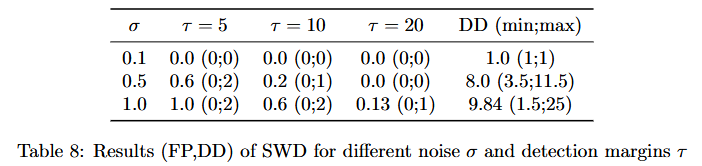
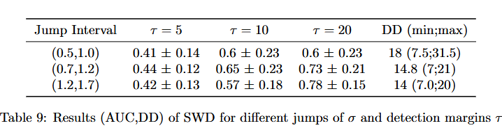
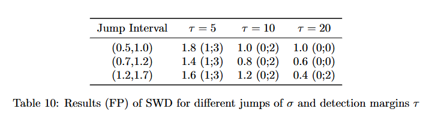
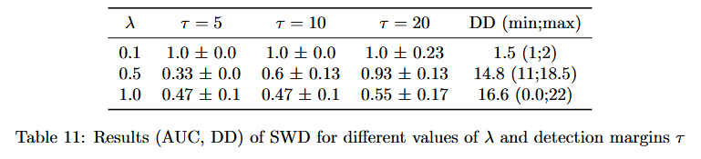
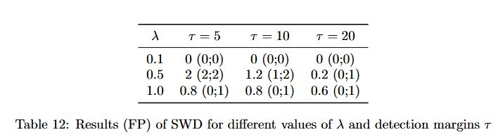
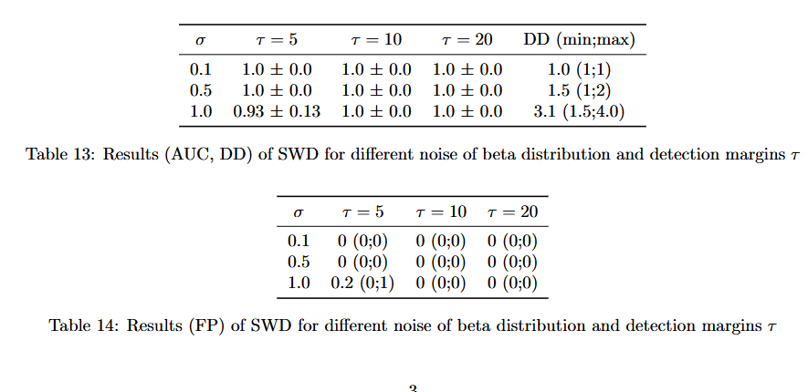

# AdditionalExperiments

1) [Grid Search](#grid-search-of-proposed-method-on-mnist-sequences)
2) [Additional Baseline and Metrics](#additional-baseline)
3) [Synthetic Experiments & Metrics](#additional-synthetic-experiments)

## Grid Search of proposed method on MNIST sequences

## Grid Search of proposed method on Occupancy dataset

## Additional Baseline
Inclusion of [1] Cheng, Kevin C., et al. "Optimal transport based change point detection and time series segment clustering." ICASSP 2020-2020 IEEE International Conference on Acoustics, Speech and Signal Processing (ICASSP)

### 1) Occupancy

### 2) MNIST

### 3) HASC 

## Additional Synthetic Experiments

### 1) Normal Distribution (New Metrics)

### 2) Change in variance of data

### 3) Exponential Distribution

### 4) Beta Distribution

