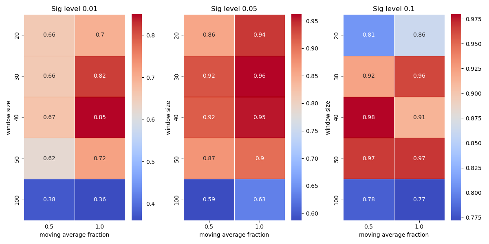
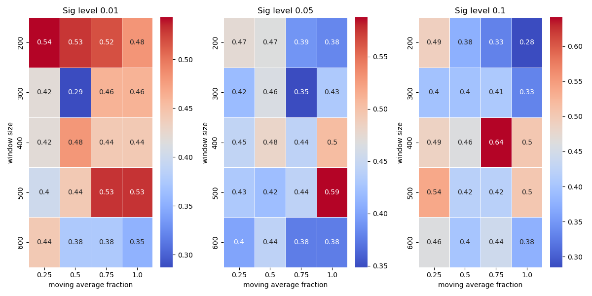
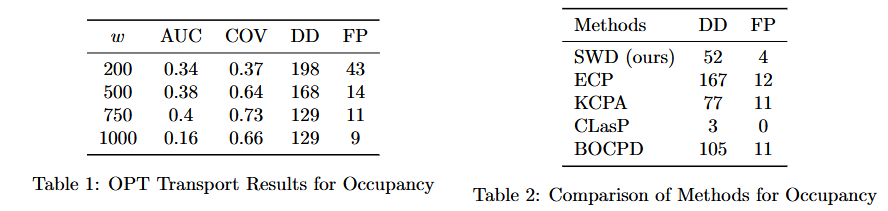
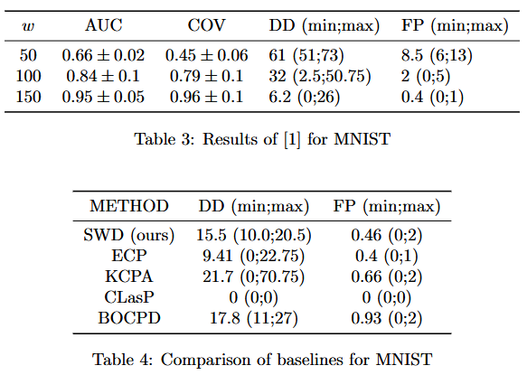
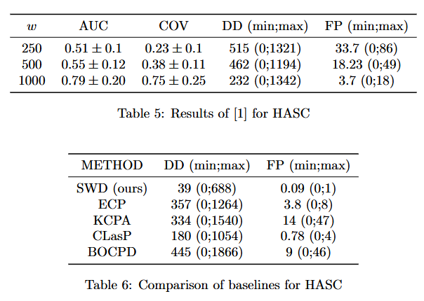

# AdditionalExperiments

## Grid Search of proposed method on MNIST sequences

## Grid Search of proposed method on Occupancy dataset

## Inclusion of [1] Cheng, Kevin C., et al. "Optimal transport based change point detection and time series segment clustering." ICASSP 2020-2020 IEEE International Conference on Acoustics, Speech and Signal Processing (ICASSP)

### 1) Occupancy

### 2) MNIST

### 3) HASC 

## Additional Synthetic Experiments

